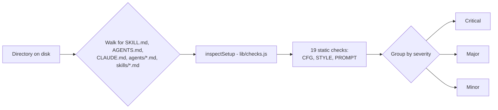

# prompt-auditor

**Version**: 0.1.0
**Author**: John Conneely
**License**: <!-- TODO: no LICENSE exists yet upstream (github.com/YoungLeadersDotTech/left-the-chat). Add one there and here once it's settled. -->

## Overview

`prompt-auditor` is a deterministic, offline auditor for Claude Code skills, agents, and
prompts. It runs 19 static checks against `SKILL.md`, `AGENTS.md`, `CLAUDE.md`,
`agents/*.md`, and `skills/*.md` files and prints findings grouped critical, then major,
then minor - no model call, no network request, and no upload involved in producing a
finding.

Vendored from [YoungLeadersDotTech/left-the-chat](https://github.com/YoungLeadersDotTech/left-the-chat),
built for the AI Tinkerers Dublin hackathon ("Agents, Everywhere", 12 September 2026),
where the same checks also run in a small companion web page that additionally compares
declared setup against real runtime telemetry. That page is not part of this plugin;
`left-the-chat` remains the source of truth for the checks themselves.

## What's included

| Component | Count | Notes |
|---|---|---|
| Skill | 1 | `audit`, invoked as `/prompt-auditor:audit` |
| Static checks | 19 | 4 config (`CFG-*`), 3 style (`STYLE-*`), 12 prompt-quality (`PROMPT-*`) |
| CLI | 1 | `skills/audit/scripts/audit.mjs`, called by the skill |
| Pre-commit hook (optional) | 1 | `skills/audit/scripts/audit-staged.mjs`, disabled by default |

## Skills

| Skill | Description |
|---|---|
| `audit` | Runs a deterministic offline static audit on a directory of skills, agents, or prompts (`SKILL.md`, `AGENTS.md`, `CLAUDE.md`) and prints findings. Use for local review of these. Not for runtime telemetry comparison or unrelated code review. |

## Install

```
/plugin marketplace add YoungLeadersDotTech/young-leaders-tech-marketplace
/plugin install prompt-auditor@young-leaders-tech-marketplace
/reload-plugins
```

## Usage



Ask the skill to audit a directory, or run the CLI it wraps directly:

```bash
node "${CLAUDE_PLUGIN_ROOT}/skills/audit/scripts/audit.mjs" <directory>
```

`examples/find-ai-events.md` is a task prompt written to trip every `PROMPT-*` check, with
`examples/find-ai-events-fixed.md` alongside it as the corrected version - a quick way to
see the full report shape without writing a prompt from scratch.

### Optional pre-commit hook

On first run in a repository, the skill offers to write a small `.git/hooks/pre-commit`
wrapper (or a `core.hooksPath` entry) that calls
`skills/audit/scripts/audit-staged.mjs` against staged agent files. Disabled by default,
and only ever asked for, never enabled unprompted.

## Notes

- Static checks only. Declared-versus-actual findings (a tool granted but never called, a
  skill that never fires) need runtime telemetry, which this CLI does not have.
- Read-only against the audited files, other than the pre-commit hook file it is
  explicitly asked to write.
